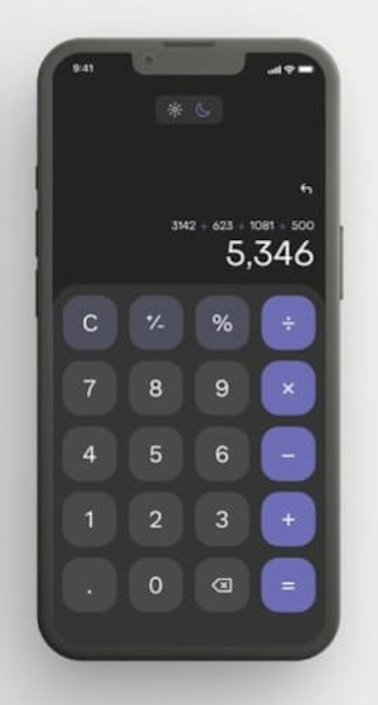
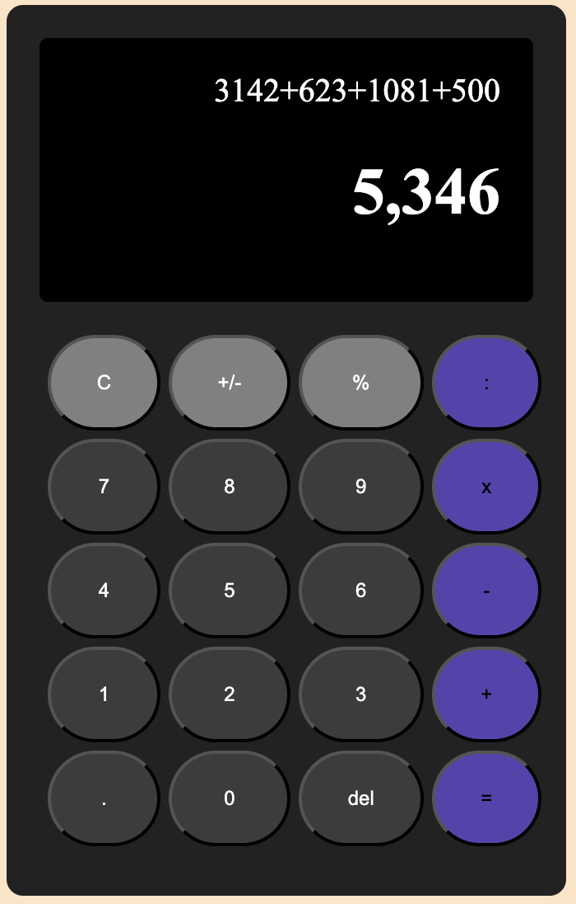

## Create calculator using grid from CSS external

This repository contains a project on how to create a calculator, which focuses on documenting HTML and CSS structures using grids, for future development. This project aims to learn the use of external CSS and go deeper into the use of grids.

## Preview



## Result



## How to Run this project

1. Clone this project

```
git clone    https://github.com/Dwaysetya/fgo24-css-calculator
```

2. Enter the project firectory

```
cd directory-name
```

3. Install the Depedencies

```
npm install
```

4. run the project

```
npm run dev
```

5. Project will running on http://localhost:8080

## Depedencies

This project requires Node.js to run, so make sure Node.js is installed on your device.

- live-server: used to document an HTTP server locally, easing the development and testing process.

## Basic Information

This project was developed as part of the learning program at Kodacademy Bootcamp Batch 24, which was carried out by Dwi Setyabudi in order to deepen the understanding and technical skills acquired during the training.
